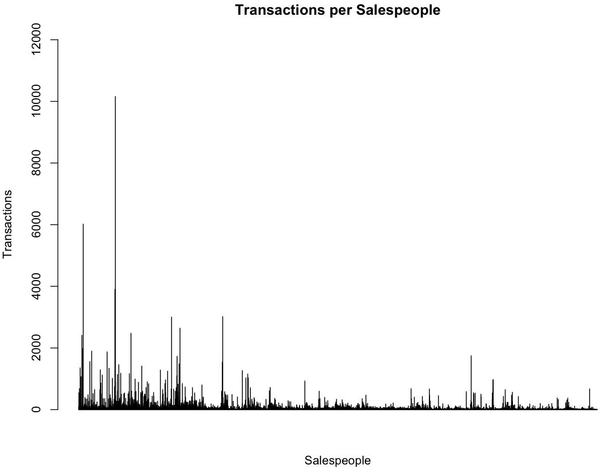
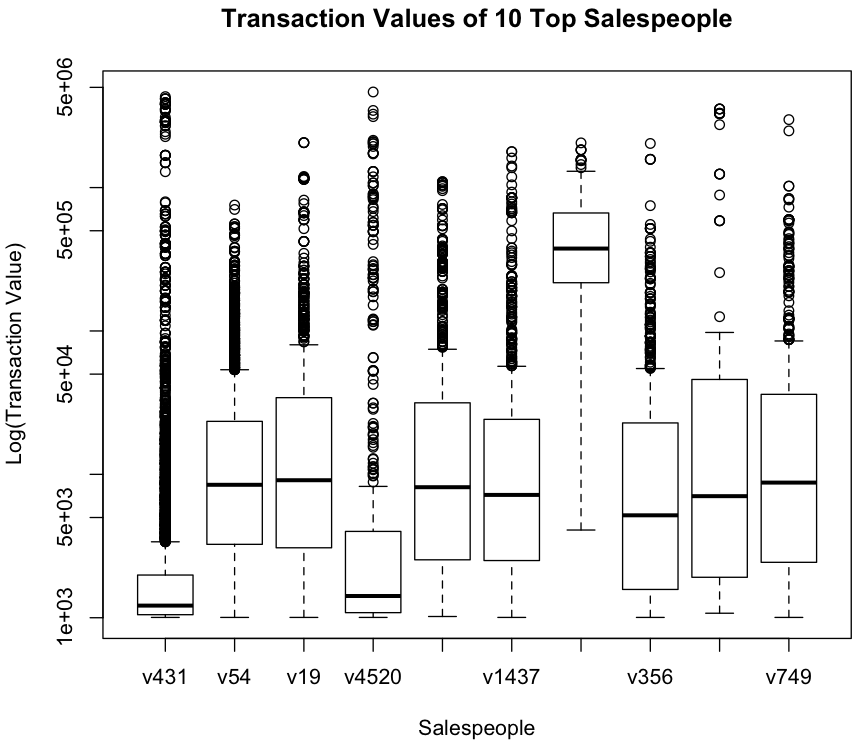
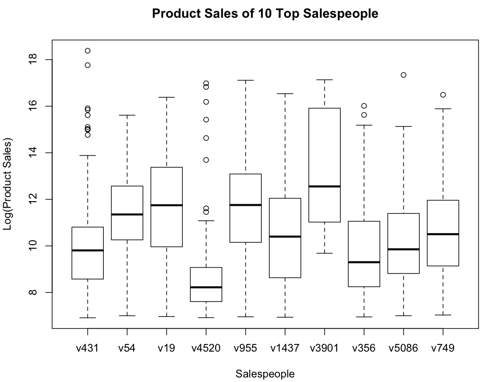
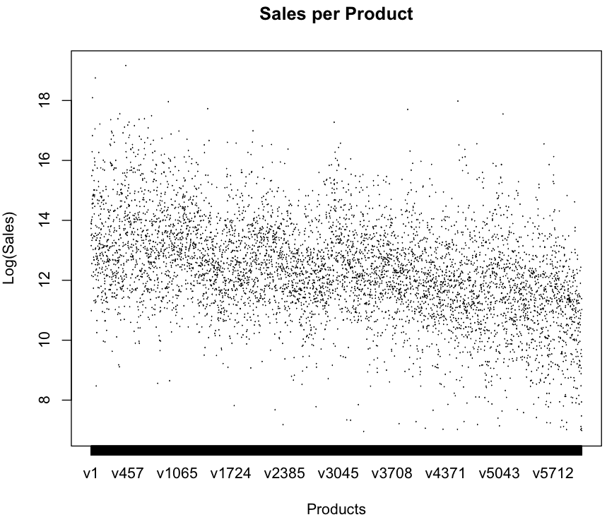
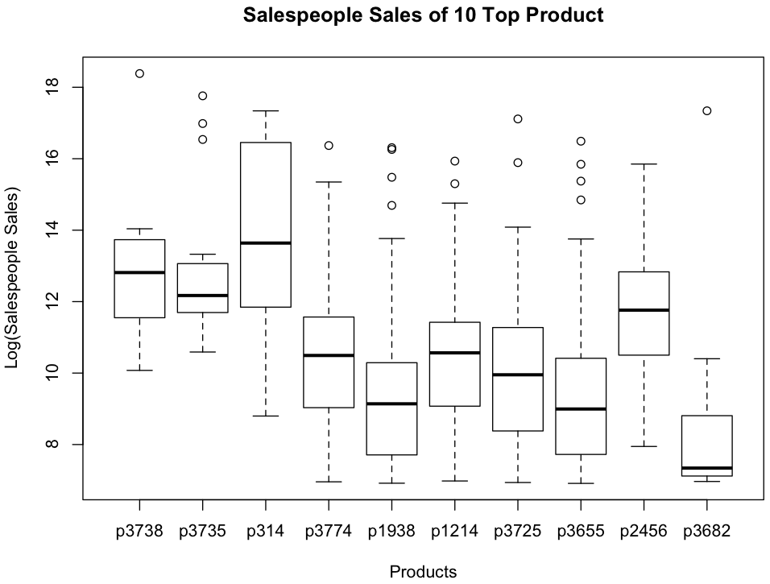
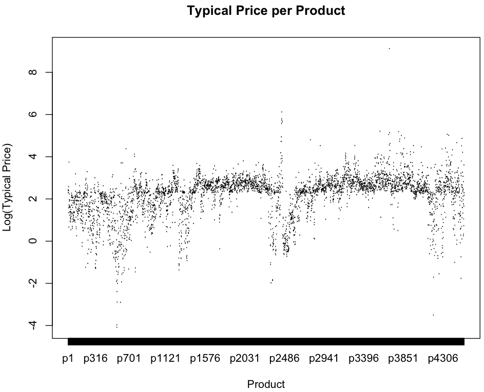

# Exploratory Data Analysis with R

## Basic
~~~
> attach(sales)

> head(sales)

  ID Prod Quant   Val Insp
1 v1   p1   182  1665 unkn
2 v2   p1  3072  8780 unkn
3 v3   p1 20393 76990 unkn
4 v4   p1   112  1100 unkn
5 v3   p1  6164 20260 unkn
6 v5   p2   104  1155 unkn

> summary(sales)

       ID              Prod            Quant                Val             Insp       
 v431   : 10159   p1125  :  3923   Min.   :      100   Min.   :   1005   ok   : 14462  
 v54    :  6017   p3774  :  1824   1st Qu.:      107   1st Qu.:   1345   unkn :385414  
 v426   :  3902   p1437  :  1720   Median :      168   Median :   2675   fraud:  1270  
 v1679  :  3016   p1917  :  1702   Mean   :     8442   Mean   :  14617                 
 v1085  :  3001   p4089  :  1598   3rd Qu.:      738   3rd Qu.:   8680                 
 v1183  :  2642   p2742  :  1519   Max.   :473883883   Max.   :4642955                 
 (Other):372409   (Other):388860   NA's   :13842       NA's   :1182                    

> nlevels(ID)
[1] 6016

> nlevels(Prod)
[1] 4548

> table(sales$Insp) / nrow(sales) * 100 

       ok      unkn     fraud 
 3.605171 96.078236  0.316593 

> length(which(is.na(sales$Quant) & is.na(sales$Val)))
[1] 888

> head(sales[which(is.na(sales$Quant) & is.na(sales$Val)),])
        ID  Prod Quant Val Insp
3475   v29  p808    NA  NA unkn
4433  v453  p921    NA  NA unkn
5393  v431 p1035    NA  NA unkn
5503  v431    p1    NA  NA unkn
5505  v431    p1    NA  NA unkn
5913 v1039 p1101    NA  NA unkn

> length(which(is.na(sales$Quant) & sales$Insp == 'ok'))
[1] 110

> head(sales[which(is.na(sales$Quant) & sales$Insp == 'ok'),])
        ID  Prod Quant  Val Insp
3459  v614  p807    NA 1010   ok
6450 v1295 p1125    NA 1025   ok
6516  v950 p1125    NA 1240   ok
6520 v1158 p1125    NA 1005   ok
6536   v10 p1125    NA 1445   ok
6624  v709 p1125    NA   NA   ok

> length(which(is.na(sales$Val) & sales$Insp == 'ok'))
[1] 8

> sales[which(is.na(sales$Val) & sales$Insp == 'ok'),]
         ID  Prod Quant Val Insp
6365  v1039 p1125   100  NA   ok
6624   v709 p1125    NA  NA   ok
9346   v796 p1436   100  NA   ok
9475  v1043 p1437   106  NA   ok
9804  v1039 p1462   100  NA   ok
9808  v1109 p1462    NA  NA   ok
15414 v1158 p1910    NA  NA   ok
19853 v1958 p2272   101  NA   ok

> length(which(is.na(sales$Quant) & is.na(sales$Val) & sales$Insp == 'ok'))
[1] 3

> sales[which(is.na(sales$Quant) & is.na(sales$Val) & sales$Insp == 'ok'), ]

         ID  Prod Quant Val Insp
6624   v709 p1125    NA  NA   ok
9808  v1109 p1462    NA  NA   ok
15414 v1158 p1910    NA  NA   ok
~~~

## Salespeople
~~~
> barplot(table(sales$ID), main="Transactions per Salespeople", names.arg="", xlab="Salespeople", ylab="Transactions", ylim=c(0,12000))
~~~

~~~
> valueByID <- aggregate(Val, list(ID), sum, na.rm=TRUE)

> head(valueByID)

  Group.1       x
1      v1  917030
2      v2 1090375
3      v3  517490
4      v4  728880
5      v5   59050
6      v6 1164325

> plot(log(valueByID$x) ~ valueByID$Group.1, main="Sales per Salespeople", names.arg="", xlab="Salespeople", ylab="Log(Sales)")
~~~

~~~
> valueByID[order(valueByID$x, decreasing=TRUE)[1:10],]

     Group.1         x
427     v431 211489170
54       v54 139322315
19       v19  71983200
4497   v4520  64398195
949     v955  63182215
1431   v1437  50013195
3882   v3901  48769945
354     v356  42131925
5050   v5086  41845760
743     v749  39526285

> topIDs <- valueByID[order(valueByID$x, decreasing=TRUE)[1:10], "Group.1"]

> topSalesByID <- sales[ID %in% topIDs, c("ID", "Prod", "Val")]

> topSalesByID$ID.f <- factor(topSalesByID$ID, topIDs)

> boxplot(Val ~ ID.f, data= topSalesByID, main="Transaction Values of 10 Top Salespeople", xlab="Salespeople", ylab="Log(Transaction Value)", log="y")
~~~

~~~
> topSalesByIDProd <- aggregate(topSalesByID$Val, list(topSalesByID$ID, topSalesByID$Prod), sum, na.rm=TRUE)

> head(topSalesByIDProd)

  Group.1 Group.2       x
1    v431      p1   60720
2    v749      p1  475740
3    v431      p3   10720
4    v431      p4       0
5    v431      p5    1760
6     v54     p16 6032990

> topSalesByIDProd$Group.1 <- factor(topSalesByIDProd$Group.1, topIDs)

> boxplot(log(x) ~ Group.1, data=topSalesByIDProd, main="Product Sales of 10 Top Salespeople", xlab="Salespeople", ylab="Log(Product Sales)")
~~~

~~~
> head(valueByID[order(valueByID$x),])

     Group.1    x
3342   v3355 1050
6015   v6069 1080
5828   v5876 1115
6004   v6058 1115
4492   v4515 1125
4315   v4337 1130

> bottomIDs <- valueByID[order(valueByID$x)[1:100], "Group.1"]

> bottomSalesByID <- sales[ID %in% bottomIDs, c("ID", "Prod", "Val")]

> bottomSalesByID$ID.f <- factor(bottomSalesByID$ID, bottomIDs)

> boxplot(Val ~ ID.f, data= bottomSalesByID, main="Transaction Values of 100 Bottom Salespeople", xlab="Salespeople", ylab="Transaction Value")
~~~

~~~
# Top 100 Salespeople account for 38% income

> sum(valueByID[order(valueByID$x, decreasing=T)[1:100], 2]) / sum(Val, na.rm=T) * 100
[1] 38.33277

# Bottom 2000 Salespeople account for less than 2% income

> sum(valueByID[order(valueByID $x, decreasing=F)[1:2000], 2]) / sum(Val, na.rm=T) * 100
[1] 1.988716
~~~

## Products
~~~
> barplot(table(sales$Prod), main="Transactions per Product", names.arg="", xlab="Products", ylab="Transactions", ylim=c(0,4000))
~~~

~~~
> valueByProd <- aggregate(Val, list(Prod), sum, na.rm=TRUE)

> head(valueByProd)

  Group.1       x
1      p1 1409340
2      p2  497195
3      p3  193005
4      p4 1816245
5      p5 2960385
6      p6  267700

> plot(log(valueByID$x) ~ valueByID$Group.1, main="Sales per Product", names.arg="", xlab="Products", ylab="Log(Sales)")
~~~

~~~
> valueByProd[order(valueByProd$x, decreasing=TRUE)[1:10],]

     Group.1         x
3738   p3738 102544065
3735   p3735  93342190
314     p314  78503390
3774   p3774  45926100
1938   p1938  41813875
1214   p1214  39212400
3725   p3725  38302795
3655   p3655  34743160
2456   p2456  34427235
3682   p3682  34016270

> topProds <- valueByProd[order(valueByProd$x, decreasing=TRUE)[1:10], "Group.1"]

> topSalesByProd <- sales[Prod %in% topProds, c("ID", "Prod", "Val")]

> topSalesByProd$Prod.f <- factor(topSalesByProd$Prod, topProds)

> boxplot(Val ~ Prod.f, data= topSalesByProd, main="Transaction Values of 10 Top Products", xlab="Products", ylab="Log(Transaction Value)", log="y")
~~~

~~~
> topSalesByProdID <- aggregate(topSalesByProd$Val, list(topSalesByProd$Prod, topSalesByProd$ID), sum, na.rm=TRUE)

> head(topSalesByProdID)

  Group.1 Group.2      x
1   p3655      v1   8810
2   p3774      v1  91785
3   p3655      v4   2675
4   p1938      v8  18100
5   p1214     v10 465405
6   p3655     v10  41560

> topSalesByProdID$Group.1 <- factor(topSalesByProdID$Group.1, topProds)

> boxplot(log(x) ~ Group.1, data=topSalesByProdID, main="Salespeople Sales of 10 Top Product", xlab="Products", ylab="Log(Salespeople Sales)")
~~~

~~~
> head(valueByProd[order(valueByProd$x),])

     Group.1     x
4491   p4491 10155
1653   p1653 11295
4436   p4436 12420
189     p189 12605
669     p669 12760
4172   p4172 12795

> bottomProds <- valueByProd[order(valueByProd$x)[1:100], "Group.1"]

> bottomSalesByProd <- sales[Prod %in% bottomProds, c("ID", "Prod", "Val")]

> bottomSalesByProd$Prod.f <- factor(bottomSalesByProd$Prod, bottomProds)

> boxplot(log(Val) ~ Prod.f, data= bottomSalesByProd, main="Transaction Values of 100 Bottom Products", xlab="Products", ylab="log(Transaction Value)")
~~~

~~~
# Top 100 products account for 75% quantity

> sum(as.double(quantByProd[order(quantByProd$x, decreasing=T)[1:100], 2])) / sum(as.double(Quant), na.rm=T) * 100
[1] 74.63478

# Bottom 3000 products account for 2.24% quantity

> sum(as.double(quantByProd[order(quantByProd$x, decreasing=F)[1:3000], 2])) / sum(as.double(Quant), na.rm=T) * 100
[1] 2.241725
~~~

## Unit Price
~~~
> sales$Uprice <- Val/Quant

> head(sales)

  ID Prod Quant   Val Insp    Uprice
1 v1   p1   182  1665 unkn  9.148352
2 v2   p1  3072  8780 unkn  2.858073
3 v3   p1 20393 76990 unkn  3.775315
4 v4   p1   112  1100 unkn  9.821429
5 v3   p1  6164 20260 unkn  3.286827
6 v5   p2   104  1155 unkn 11.105769

> summary(sales$Uprice)

    Min.  1st Qu.   Median     Mean  3rd Qu.     Max.     NA's 
    0.00     8.46    11.89    20.30    19.11 26460.00    14136 

> tPrice <- aggregate(sales$Uprice, list(Prod), median, na.rm=TRUE)

> head(tPrice)

  Group.1         x
1      p1 11.428571
2      p2 10.877863
3      p3 10.000000
4      p4  9.911243
5      p5 11.000000
6      p6 13.270677

> plot(log(tPrice$x) ~ tPrice$Group.1, main="Typical Price per Product", names.arg="", xlab="Products", ylab="Log(Typical Price)")
~~~

~~~
> tPrice[order(tPrice$x, decreasing=TRUE)[1:10],]

     Group.1         x
3689   p3689 9204.1954
2453   p2453  456.0784
2452   p2452  329.3137
2456   p2456  304.8515
2459   p2459  283.8119
2451   p2451  262.2277
3581   p3581  183.1237
3795   p3795  179.9410
3691   p3691  171.2745
4354   p4354  158.0660

> expensives <- tPrice[order(tPrice$x, decreasing=TRUE)[1:10], "Group.1"]

> expensiveSales <- sales[Prod %in% expensives, c("ID", "Prod", "Val")]

> boxplot(Val ~ Prod.f, data= expensiveSales, main="Transaction Values of 10 Expensive Products", xlab="Products", ylab="Log(Transaction Value)", log="y")
~~~

~~~
> tPrice[order(tPrice$x)[1:10],]

     Group.1          x
560     p560 0.01688455
559     p559 0.01884438
4195   p4195 0.03025914
601     p601 0.05522265
563     p563 0.05576406
561     p561 0.09115803
566     p566 0.13590731
2330   p2330 0.13886771
613     p613 0.14521402
555     p555 0.14972394

> tops <- sales[Prod %in% c("p560", "p3689"), c("Prod", "Uprice")]

> tops$Prod.f <- factor(tops$Prod)
 
> boxplot(Uprice ~ Prod.f, data=tops, ylab="Uprice", log="y")
~~~

