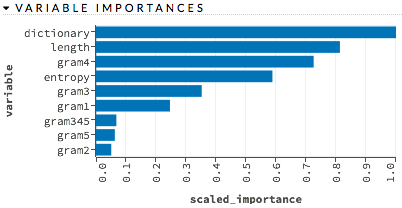
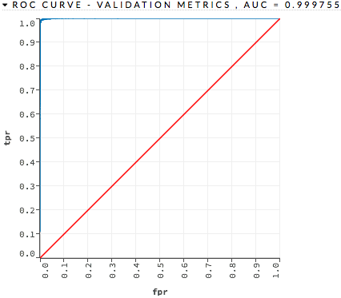
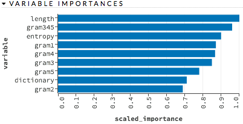
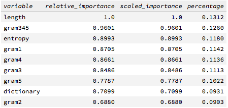

## Model Selection using H2O with R

### Starting with R
~~~
> trainH2O <- as.h2o(traindga)

> testH2O <- as.h2o(testdga)
~~~

### Random Forest with H2O
~~~
(1) Goto http://127.0.0.1:54321/flow/index.html

(2) Click "getFrames" under "Assistance"

(3) Choose the frame "traindga" and click "Build Model"

(4) Select an algorithm: "Distributed Random Forest"

(5) validation_frame: "testdga"; response_column: "class"; ntrees: 50; mtries: -1; score_each_iteration: checked; stopping_rounds: 10; stopping_metric: "AUC"; stopping_tolerance: 0.001; seed: 1000000

(6) Click "Build Model"

(7) Click "View" and "Predict"
~~~

~~~
# go back to R

# using AUC as stopping metric

> h2o.confusionMatrix(h2o.getModel("drf-8c9592db-1500-4092-bdc6-1e2bc2911fda"), h2o.getFrame("testdga"))

Confusion Matrix for max f1 @ threshold = 0.454545454545455:
        dga legit    Error      Rate
dga    1244     6 0.004800   =6/1250
legit     4  1244 0.003205   =4/1248
Totals 1248  1250 0.004003  =10/2498

> h2o.confusionMatrix(h2o.getModel("drf-8c9592db-1500-4092-bdc6-1e2bc2911fda"), h2o.getFrame("traindga"))

Confusion Matrix for max f1 @ threshold = 0.545454545454545:
        dga legit    Error     Rate
dga    3750     0 0.000000  =0/3750
legit     0  3752 0.000000  =0/3752
Totals 3750  3752 0.000000  =0/7502

# using logloss as stopping metric

> h2o.confusionMatrix(h2o.getModel("drf-8c9592db-1500-4092-bdc6-1e2bc2911fda"), h2o.getFrame("testdga"))

Confusion Matrix for max f1 @ threshold = 0.42:
        dga legit    Error      Rate
dga    1242     8 0.006400   =8/1250
legit     4  1244 0.003205   =4/1248
Totals 1246  1252 0.004804  =12/2498

> h2o.confusionMatrix(h2o.getModel("drf-8c9592db-1500-4092-bdc6-1e2bc2911fda"), h2o.getFrame("traindga"))

Confusion Matrix for max f1 @ threshold = 0.64:
        dga legit    Error     Rate
dga    3750     0 0.000000  =0/3750
legit     0  3752 0.000000  =0/3752
Totals 3750  3752 0.000000  =0/7502
~~~

### Logistic Regression with H2O
~~~
(1) Choose the frame "traindga" and click "Build Model"

(2) Select an algorithm: "Generalized Linear Modeling"

(3) validation_frame: "testdga"; response_column: "class"; family: binomial; score_each_iteration: checked;

(4) Click "Build Model"

(5) Click "View" and "Predict"
~~~

~~~
# go back to R

> h2o.confusionMatrix(h2o.getModel("glm-f477a602-8a31-4da7-8f58-80d3d65653eb"), h2o.getFrame("testdga"))

Confusion Matrix for max f1 @ threshold = 0.417488962038092:
        dga legit    Error      Rate
dga    1246     4 0.003200   =4/1250
legit    11  1237 0.008814  =11/1248
Totals 1257  1241 0.006005  =15/2498

> h2o.confusionMatrix(h2o.getModel("glm-f477a602-8a31-4da7-8f58-80d3d65653eb"), h2o.getFrame("traindga"))

Confusion Matrix for max f1 @ threshold = 0.39645134669577:
        dga legit    Error      Rate
dga    3719    31 0.008267  =31/3750
legit    21  3731 0.005597  =21/3752
Totals 3740  3762 0.006931  =52/7502
~~~

### Deep Learning with H2O
~~~
(1) Choose the frame "traindga" and click "Build Model"

(2) Select an algorithm: "Deep Learning"

(3) validation_frame: "testdga"; response_column: "class"; activation: RectifierWithDropout; hidden: 100,100; epochs: 10; variable_importances: checked; score_each_iteration: checked; stopping_rounds: 10; stopping_metric: "AUC"; stopping_tolerance: 0.001; seed: 1000000

(4) Click "Build Model"

(5) Click "View" and "Predict"
~~~

~~~
# go back to R

# using AUC as stopping metric

> h2o.confusionMatrix(h2o.getModel("deeplearning-470eb660-bcab-4598-8bfd-2795de8e65c5"), h2o.getFrame("testdga"))

Confusion Matrix for max f1 @ threshold = 0.0234385055057513:
        dga legit    Error      Rate
dga    1245     5 0.004000   =5/1250
legit    10  1238 0.008013  =10/1248
Totals 1255  1243 0.006005  =15/2498

> h2o.confusionMatrix(h2o.getModel("deeplearning-470eb660-bcab-4598-8bfd-2795de8e65c5"), h2o.getFrame("traindga"))

Confusion Matrix for max f1 @ threshold = 0.0299973457665013:
        dga legit    Error      Rate
dga    3730    20 0.005333  =20/3750
legit    26  3726 0.006930  =26/3752
Totals 3756  3746 0.006132  =46/7502

# using logloss as stopping metric

> h2o.confusionMatrix(h2o.getModel("deeplearning-470eb660-bcab-4598-8bfd-2795de8e65c5"), h2o.getFrame("testdga"))

Confusion Matrix for max f1 @ threshold = 0.729475424630688:
        dga legit    Error      Rate
dga    1246     4 0.003200   =4/1250
legit    10  1238 0.008013  =10/1248
Totals 1256  1242 0.005604  =14/2498

> h2o.confusionMatrix(h2o.getModel("deeplearning-470eb660-bcab-4598-8bfd-2795de8e65c5"), h2o.getFrame("traindga"))

Confusion Matrix for max f1 @ threshold = 0.618384636742149:
        dga legit    Error      Rate
dga    3724    26 0.006933  =26/3750
legit    20  3732 0.005330  =20/3752
Totals 3744  3758 0.006132  =46/7502
~~~
