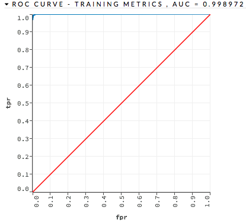
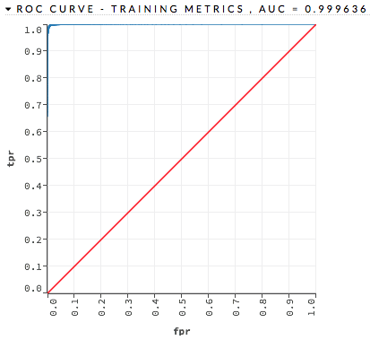
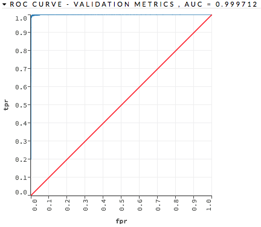

## Model Selection using H2O with R

### Starting with R
~~~
# The following two commands remove any previously installed H2O packages for R.

if ("package:h2o" %in% search()) { detach("package:h2o", unload=TRUE) }
if ("h2o" %in% rownames(installed.packages())) { remove.packages("h2o") }

Removing package from ‘/Library/Frameworks/R.framework/Versions/3.2/Resources/library’

# Next, we download packages that H2O depends on.

pkgs <- c("methods","statmod","stats","graphics","RCurl","jsonlite","tools","utils")
for (pkg in pkgs) {
    if (! (pkg %in% rownames(installed.packages()))) { install.packages(pkg) }
}

# Now we download, install and initialize the H2O package for R.

> install.packages("h2o")

> library(h2o)

> localH2O <- h2o.init(nthreads = -1)

H2O is not running yet, starting it now...

Note:  In case of errors look at the following log files:
    /var/folders/6k/26gz272d5t503whnjyd5ssj80000gn/T//RtmpeD62jp/h2o_scheng_started_from_r.out
    /var/folders/6k/26gz272d5t503whnjyd5ssj80000gn/T//RtmpeD62jp/h2o_scheng_started_from_r.err

java version "1.8.0_66"
Java(TM) SE Runtime Environment (build 1.8.0_66-b17)
Java HotSpot(TM) 64-Bit Server VM (build 25.66-b17, mixed mode)

Starting H2O JVM and connecting: ... Connection successful!

R is connected to the H2O cluster: 
    H2O cluster uptime:         2 seconds 722 milliseconds 
    H2O cluster version:        3.8.1.3 
    H2O cluster name:           H2O_started_from_R_scheng_txh686 
    H2O cluster total nodes:    1 
    H2O cluster total memory:   0.89 GB 
    H2O cluster total cores:    4 
    H2O cluster allowed cores:  4 
    H2O cluster healthy:        TRUE 
    H2O Connection ip:          localhost 
    H2O Connection port:        54321 
    H2O Connection proxy:       NA 
    R Version:                  R version 3.2.3 (2015-12-10) 

> trainH2O <- as.h2o(traindga)

> testH2O <- as.h2o(testdga)
~~~

### Random Forest with H2O
~~~
(1) Goto http://127.0.0.1:54321/flow/index.html

(2) Click "getFrames" under "Assistance"

(3) Choose the frame "traindga" and click "Build Model"

(4) Select an algorithm: "Distributed Random Forest"

(5) validation_frame: "testdga"; response_column: "class"; ntrees: 50; stopping_metric: AUC

(6) Click "Build Model"

(7) Click "View" and "Predict"
~~~

~~~
# go back to R

# using AUC as stopping metric

> h2o.confusionMatrix(h2o.getModel("drf-8c9592db-1500-4092-bdc6-1e2bc2911fda"), h2o.getFrame("testdga"))

Confusion Matrix for max f1 @ threshold = 0.26:
        dga legit    Error      Rate
dga    1241     9 0.007200   =9/1250
legit     2  1246 0.001603   =2/1248
Totals 1243  1255 0.004404  =11/2498

> h2o.confusionMatrix(h2o.getModel("drf-8c9592db-1500-4092-bdc6-1e2bc2911fda"), h2o.getFrame("traindga"))

Confusion Matrix for max f1 @ threshold = 0.59:
        dga legit    Error     Rate
dga    3750     0 0.000000  =0/3750
legit     0  3752 0.000000  =0/3752
Totals 3750  3752 0.000000  =0/7502

# using logloss as stopping metric

> h2o.confusionMatrix(h2o.getModel("drf-8e1a301f-ea59-4ab4-b5f2-6beab1cc9262"), h2o.getFrame("testdga"))

Confusion Matrix for max f1 @ threshold = 0.42:
        dga legit    Error      Rate
dga    1242     8 0.006400   =8/1250
legit     5  1243 0.004006   =5/1248
Totals 1247  1251 0.005204  =13/2498

> h2o.confusionMatrix(h2o.getModel("drf-8e1a301f-ea59-4ab4-b5f2-6beab1cc9262"), h2o.getFrame("traindga"))

Confusion Matrix for max f1 @ threshold = 0.54:
        dga legit    Error     Rate
dga    3750     0 0.000000  =0/3750
legit     0  3752 0.000000  =0/3752
Totals 3750  3752 0.000000  =0/7502
~~~

### Logistic Regression with H2O
~~~
(1) Choose the frame "traindga" and click "Build Model"

(2) Select an algorithm: "Generalized Linear Modeling"

(3) validation_frame: "testdga"; response_column: "class"; family: binomial

(4) Click "Build Model"

(5) Click "View" and "Predict"
~~~

~~~
# go back to R

> h2o.confusionMatrix(h2o.getModel("glm-f477a602-8a31-4da7-8f58-80d3d65653eb"), h2o.getFrame("testdga"))
Confusion Matrix for max f1 @ threshold = 0.417488962038092:
        dga legit    Error      Rate
dga    1246     4 0.003200   =4/1250
legit    11  1237 0.008814  =11/1248
Totals 1257  1241 0.006005  =15/2498
~~~

### Deep Learning with H2O
~~~
(1) Choose the frame "traindga" and click "Build Model"

(2) Select an algorithm: "Deep Learning"

(3) validation_frame: "testdga"; response_column: "class"; activation: RectifierWithDropout; hidden: 100,100; epochs: 10; stopping_metric: AUC

(4) Click "Build Model"

(5) Click "View" and "Predict"
~~~

~~~
# go back to R

# using AUC as stopping metric

> h2o.confusionMatrix(h2o.getModel("deeplearning-470eb660-bcab-4598-8bfd-2795de8e65c5"), h2o.getFrame("testdga"))

Confusion Matrix for max f1 @ threshold = 0.976170330303615:
        dga legit    Error      Rate
dga    1247     3 0.002400   =3/1250
legit    18  1230 0.014423  =18/1248
Totals 1265  1233 0.008407  =21/2498

> h2o.confusionMatrix(h2o.getModel("deeplearning-470eb660-bcab-4598-8bfd-2795de8e65c5"), h2o.getFrame("traindga"))

Confusion Matrix for max f1 @ threshold = 0.957816293636941:
        dga legit    Error      Rate
dga    3708    42 0.011200  =42/3750
legit    27  3725 0.007196  =27/3752
Totals 3735  3767 0.009198  =69/7502

# using logloss as stopping metric

> h2o.confusionMatrix(h2o.getModel("deeplearning-470eb660-bcab-4598-8bfd-2795de8e65c5"), h2o.getFrame("testdga"))

Confusion Matrix for max f1 @ threshold = 0.837299244789879:
        dga legit    Error      Rate
dga    1240    10 0.008000  =10/1250
legit    13  1235 0.010417  =13/1248
Totals 1253  1245 0.009207  =23/2498

> h2o.confusionMatrix(h2o.getModel("deeplearning-470eb660-bcab-4598-8bfd-2795de8e65c5"), h2o.getFrame("traindga"))
Confusion Matrix for max f1 @ threshold = 0.881617625564135:
        dga legit    Error      Rate
dga    3712    38 0.010133  =38/3750
legit    30  3722 0.007996  =30/3752
Totals 3742  3760 0.009064  =68/7502
~~~
